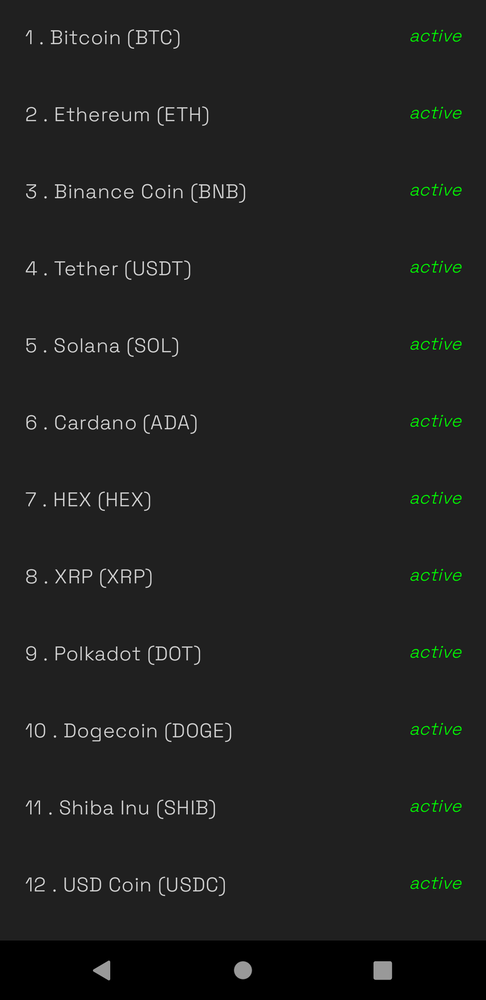
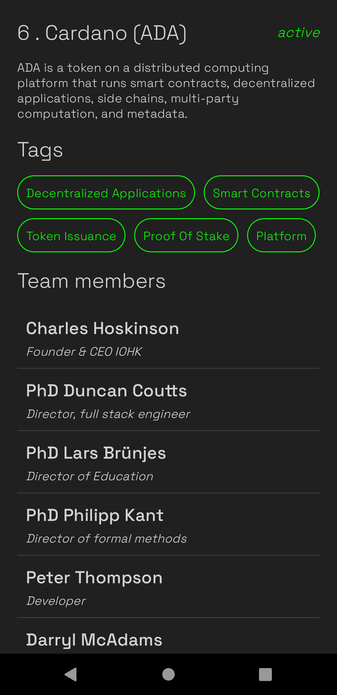
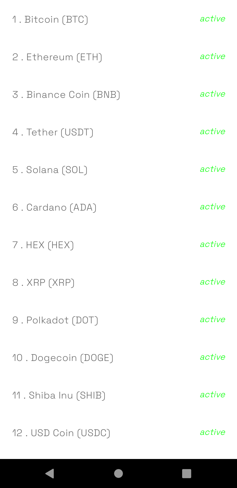

# cryptocurrency

A new Cryptocurrency project.

## Getting Started

This project is a starting point for a Jetpack Compose application based on MVVM pattern.

## Screenshots

  

## Flow of creating the App

- Package Structure
- Implementing API and Models
- Creating Repository
- Use Cases
- Dependency Injection
- ViewModels
- Composable

# Author 🙋

-  **Shivam Shashank** - [LinkedIn](https://www.linkedin.com/in/shivam-shashank-2b5766217/)
